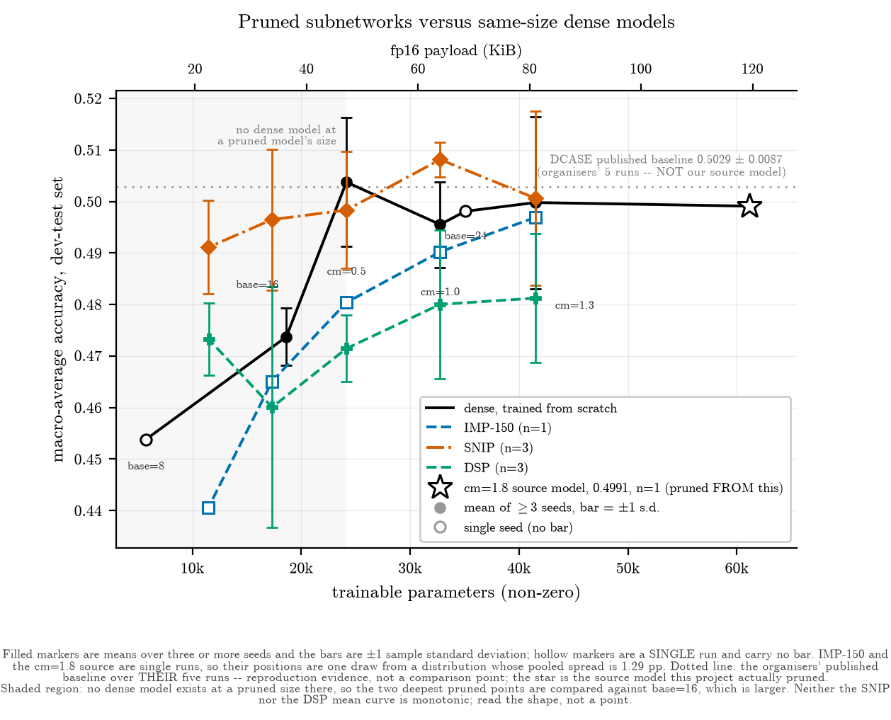

# Pruning the DCASE 2024 Task 1 baseline

Bachelor's thesis code. Johannes Kepler University Linz, Institute of Computational Perception.

Three pruning methods are applied to the official DCASE 2024 Task 1 baseline (CP-Mobile,
61,148 parameters) and each pruned model is compared against a **dense network of the same
parameter count trained from scratch** under an identical recipe. That asks a practical
question: does a subnetwork found by pruning beat the smaller network you could simply have
trained instead? It is the comparison Liu et al. put to structured pruning, and the cheapest
alternative any practitioner has. It does not establish or refute the Lottery Ticket Hypothesis
in general.

The setting makes the question harder than usual. CP-Mobile is not a large network waiting to
be compressed. It already spends 95.5 % of the challenge's 128 kB parameter budget and 98.1 %
of its 30 M multiply-accumulate budget, and it is trained here on the challenge's 25 % data
split. There is very little slack left to remove.

| | |
| --- | --- |
| Task | Acoustic scene classification, 10 classes |
| Dataset | TAU Urban Acoustic Scenes 2022 Mobile, 25 % training split |
| Metric | Macro-average accuracy, development-test set, last epoch |
| Baseline | CP-Mobile, 61,148 params, 119.43 KiB fp16, 29,419,156 MACs |
| Methods | IMP (magnitude, iterative), SNIP (single-shot at init), DSP (structured) |
| Replication | 3 seeds per point for SNIP, DSP and the contested dense references |

## Results



Pruned minus same-size dense, in percentage points. Positive means the pruned model is ahead.
The top three rows are exact size matches; the bottom two sit in a gap in the architecture's
width grid, so they are compared against `base=16`, which is **larger** than the pruned model.

| size (KiB) | dense reference | IMP-150 | SNIP (n=3) | DSP (n=3) |
| ---: | :--- | ---: | ---: | ---: |
| 81.05 | cm=1.3 (n=5) | −0.29 | **+0.08** | −1.86 |
| 63.96 | cm=1.0 (n=3) | −0.53 | **+1.26** | −1.55 |
| 47.15 | cm=0.5 (n=3) | −2.34 | **−0.54** | **−3.23** *(p = 0.029)* |
| 33.82 | base=16 (n=3) | −0.86 | **+2.28** | −1.37 |
| 22.41 | base=16 (n=3) | −3.31 | **+1.74** | −0.04 |

**No pruned model here is measurably better than the dense network of the same size.** At the
three exact matches SNIP's margins are +0.08, +1.26 and −0.54 pp and none reaches significance;
these tests establish neither superiority nor equivalence. DSP is below the dense curve at every
level, and at 47 KiB it is worse by 3.23 pp (Welch t = −3.97, nominal p = 0.029) — the only
comparison in the study to reach even nominal significance, and a negative one. That p is
unadjusted: the ten SNIP and DSP margins are a family of tests, so the inference is exploratory.

Four things are worth pulling out.

**SNIP's curve is nearly flat.** Its five three-seed means span 1.70 pp across a 3.6× reduction
in parameters. Against the source model this project actually pruned (0.4991), SNIP at 22.41 KiB
gives up 0.80 pp while being 5.3× smaller.

**Only structured pruning can buy compute.** IMP and SNIP execute 29,419,156 MACs at every
sparsity level, identical to the dense baseline, because masking a weight does not change any
tensor's shape. DSP removes whole filter groups, so its tensors *could* be rebuilt at a smaller
shape; counted that way its MACs fall by 31.7 % to 82.5 %. Those are **calculated packed-shape
counts** — the packing is not implemented here, and no model was deployed or timed, so as stored
a DSP checkpoint is a masked full-size model executing the same 29,419,156 as the rest. DSP's
strongest point is 22 KiB, where it shows no detectable accuracy difference from `base=16`
(−0.04 pp, p = 0.94) on 38 % fewer parameters and 39 % fewer calculated MACs.

**IMP's retraining budget matters more than the criterion at high sparsity.** Going from 20 to
150 retrain epochs per round is worth +0.16 pp at 81 KiB and +7.05 pp at 22 KiB. Han's paper
never specifies an epoch budget, so any IMP result at high sparsity is under-determined until
that number is stated.

**Almost nothing here is statistically significant, and that is a result.** The pooled
seed-to-seed standard deviation is 1.29 pp over 30 degrees of freedom. With three seeds a side,
a margin has to reach 2.93 pp before Welch's test can reject at α = 0.05. Exactly one does.
Four conclusions drawn from single-seed data earlier in the project failed once more seeds
landed, two of them because the margin they rested on changed sign; the report lists them under
**Retractions** rather than quietly dropping them. Every accuracy here is on the development-test
split, which the project consulted while deciding what to run next — these are development-set
results, not a confirmation on held-out evaluation data.

Full tables, per-seed values, significance tests and run identifiers are in
[`reports/results.json`](reports/results.json). Running `experiments.collect_results` renders the
same data as a narrative `reports/results.md`, which is generated on demand and not tracked here.

## Layout

```
baseline/      DCASE 2024 baseline, vendored read-only (see NOTICE.md)
training/      dense training: recipe, dataset wiring, optional waveform cache
pruning/       IMP, SNIP and DSP; masking, sparsity accounting, MACs measurement
experiments/   results collection, statistics and figure generation
configs/       one YAML per experiment; no hyperparameters live in code
tests/         56 tests, including regressions on the two highest-stakes invariants
reports/       generated results, figures and the MACs measurements
```

## Setup

Dependencies are managed with [uv](https://docs.astral.sh/uv/).

```bash
uv sync
```

The dataset is not included. Download the TAU Urban Acoustic Scenes 2022 Mobile development
set from [Zenodo](https://zenodo.org/record/6337421), unpack it so that `audio/`,
`evaluation_setup/` and `meta.csv` sit inside one directory, and point `DATASET_PATH` at it:

```bash
export DATASET_PATH=data/tau_scenes_dataset      # PowerShell: $env:DATASET_PATH = "data/..."
```

The official split CSVs are vendored under `baseline/dataset/splits/`, so no file is fetched at
runtime.

## Running things

Train a dense reference:

```bash
uv run python -m training.run_training --config configs/scale_down_base16.yaml --seed 42
```

Run a pruning curve. Each config carries its own sparsity list, chosen so the pruned models land
on the parameter counts of the dense references:

```bash
uv run python -m pruning.run_pruning --config configs/snip.yaml --seed 42
uv run python -m pruning.run_pruning --config configs/imp.yaml --seed 42
uv run python -m pruning.run_pruning --config configs/imp_retrain150.yaml --seed 42
uv run python -m pruning.run_pruning --config configs/dsp.yaml --seed 42
```

A run that dies partway can be resumed without repeating finished levels:

```bash
uv run python -m pruning.run_pruning --config configs/snip.yaml --resume_run_id <wandb_run_id>
```

Measure how the two unstructured criteria distribute sparsity across layers:

```bash
uv run python -m pruning.measure_allocation
```

Regenerate `reports/results.json`, `reports/results.md` and every figure from the checkpoints:

```bash
uv run python -m experiments.collect_results
uv run python -m experiments.plot_results --bare --outdir <dir>   # figures without in-image captions
```

Two further figures stand outside the results pipeline — the device composition of the two splits
(needs the dataset) and a redrawn figure from the author's earlier practical work on ResNet-50:

```bash
uv run python -m experiments.plot_dataset
uv run python -m experiments.plot_prior_work
```

Run the tests:

```bash
uv run pytest
```

## Notes on method

A few decisions are easy to get wrong and are worth stating up front.

**Accuracy is always the last epoch's.** DCASE Task 1 has no validation split, so selecting the
best epoch by test accuracy is selecting on the test set. On the dense runs here that inflates
the number by roughly 0.5 to 0.8 pp, which is the size of most of the margins being measured.

**Two different numbers exist for the cm=1.8 baseline.** This project's own trained checkpoint
scores 0.4991 and is what every pruning run started from; the organisers report 0.5029 ± 0.0087
over five runs. The second is reproduction evidence, not a comparison point, and the two are
never mixed.

**Masked models are reported by non-zero parameter count.** As plain fp16 tensor files, IMP and
SNIP models still occupy 119.43 KiB whatever their sparsity. Their quoted sizes assume a sparse
storage format, and their MAC counts do not improve at all. DSP's removals are structural, so its
shapes can be rebuilt smaller — but that packing step is not implemented, so its MAC advantage is
calculated from the shapes its grouping implies rather than measured on a deployed model.

**The DSP implementation is an adaptation.** Three deviations from the reference are marked
`DEVIATION` in `pruning/dsp.py` and listed in `NOTICE.md`.

## Licence

MIT, see [`LICENSE`](LICENSE). Third-party code and its licences are listed in
[`NOTICE.md`](NOTICE.md).
